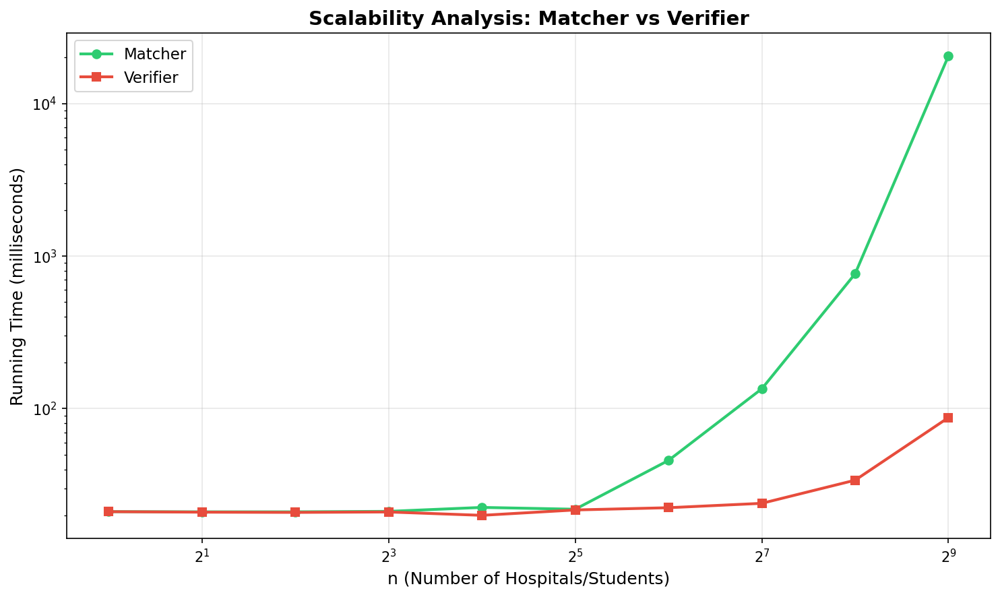

# Rocco-and-Kristian-COP4533-Programming-Assignment-1-Matching-and-Verifying
Rocco Tammone, UF ID: 36020387
Kristian O'Connor, UF ID: 83315780

Instructions: 
Written in Python 3 and only uses standard libraries. It should not need any specific build or run instructions

Run Matcher: python3 src/matcher.py data/example.in

Run Verifier: python3 src/verifier.py data/example.in data/example.out

Assumptions: 
The first line of the input file goes as follows:
First line: integer n (number of hospitals/students)
Next n lines: hospital preference lists
Next n lines: student preference lists
Each preference list contains every integer from 1 to n exactly once.

## Task C: Scalability Analysis

Both the matcher and verifier show O(n²) complexity. The matcher grows faster due to the Gale-Shapley algorithm's worst-case behavior.
